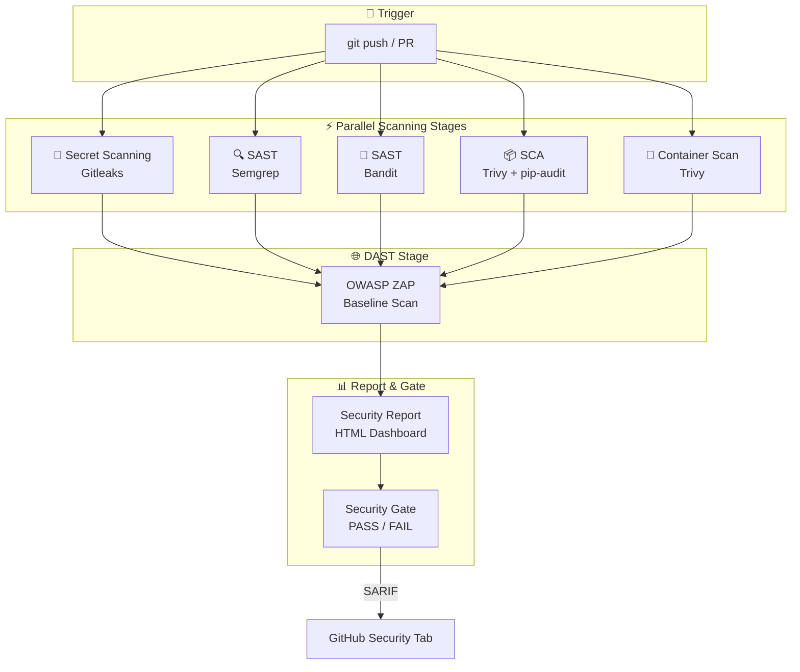

<div align="center">

# 🛡️ SecPipeline

### Automated DevSecOps CI/CD Security Pipeline

[](https://github.com/NNTung293/secpipeline/actions/workflows/security-pipeline.yml)
[](https://opensource.org/licenses/MIT)
[](#-security-tools)
[](https://owasp.org/www-project-top-ten/)

*An end-to-end CI/CD security pipeline integrating 6+ open-source tools for automated vulnerability detection across the entire SDLC.*

[View Pipeline →](https://github.com/NNTung293/secpipeline/actions) · [Security Report →](#-report-dashboard) · [Architecture →](#-architecture)

</div>

---

## 📋 Table of Contents

- [Overview](#-overview)
- [Architecture](#-architecture)
- [Security Tools](#-security-tools)
- [Pipeline Stages](#-pipeline-stages)
- [Quick Start](#-quick-start)
- [Security Findings](#-security-findings)
- [Report Dashboard](#-report-dashboard)
- [Intentionally Vulnerable App](#-intentionally-vulnerable-application)
- [Roadmap](#-roadmap)
- [Contributing](#-contributing)
- [License](#-license)
- [Disclaimer](#%EF%B8%8F-disclaimer)

---

## 🎯 Overview

**SecPipeline** demonstrates a complete **DevSecOps pipeline** that automatically scans code for security vulnerabilities at every stage of the software development lifecycle. It integrates **6 industry-standard open-source security tools** into a single GitHub Actions workflow, providing comprehensive coverage across multiple attack surfaces:

| Domain | Description |
|--------|-------------|
| 🔑 **Secret Detection** | Finds hardcoded credentials, API keys, private keys, and tokens leaked in source code and git history |
| 🔍 **Static Application Security Testing (SAST)** | Analyzes source code patterns to identify vulnerabilities such as SQL injection, XSS, and insecure deserialization |
| 📦 **Software Composition Analysis (SCA)** | Checks third-party dependencies against databases of known CVEs (Common Vulnerabilities & Exposures) |
| 🐳 **Container Scanning** | Scans Docker images for OS-level and library-level vulnerabilities before deployment |
| 🌐 **Dynamic Application Security Testing (DAST)** | Tests the live, running application for web vulnerabilities including OWASP Top 10 issues |
| 📊 **Security Reporting** | Generates a consolidated, interactive HTML dashboard with an automated security quality gate (PASS/FAIL) |

> [!WARNING]
> This project includes an **intentionally vulnerable** Flask application for demonstration purposes. See the [Disclaimer](#%EF%B8%8F-disclaimer) section before using.

### Key Features

- ⚡ **Parallel Execution** — All scanning stages run concurrently for fast feedback
- 📈 **SARIF Integration** — Results are uploaded to GitHub Security tab for native code scanning alerts
- 🚦 **Security Quality Gate** — Automated PASS/FAIL decision based on configurable severity thresholds
- 📊 **HTML Report** — Beautiful, consolidated security dashboard published as a GitHub Actions artifact
- 🐳 **Docker-Ready** — Fully containerized vulnerable app with Docker Compose for local testing
- 🔄 **CI/CD Native** — Runs on every push and pull request via GitHub Actions

---

## 🏗️ Architecture

The pipeline follows a **shift-left** security approach, running security checks as early and as often as possible in the development process.



### How It Works

1. **Trigger** — A `git push` or Pull Request triggers the pipeline
2. **Parallel Scanning** — Five scanning jobs run concurrently (Secret, SAST ×2, SCA, Container)
3. **DAST** — After the container image is built and deployed, OWASP ZAP performs a baseline scan against the running app
4. **Report & Gate** — All scan results are aggregated into an HTML dashboard, and a security gate evaluates overall risk

---

## 🔧 Security Tools

| Tool | Category | What it Detects | Output Format |
|------|----------|-----------------|---------------|
| [Gitleaks](https://github.com/gitleaks/gitleaks) | 🔑 Secret Detection | API keys, passwords, tokens, private keys in git history | SARIF |
| [Semgrep](https://github.com/semgrep/semgrep) | 🔍 SAST | OWASP Top 10, Python security anti-patterns, injection flaws | SARIF + JSON |
| [Bandit](https://github.com/PyCQA/bandit) | 🐍 SAST | Python-specific security issues (eval, exec, hardcoded passwords) | SARIF + JSON |
| [Trivy](https://github.com/aquasecurity/trivy) (fs) | 📦 SCA | Known CVEs in Python dependencies and lock files | SARIF + JSON |
| [Trivy](https://github.com/aquasecurity/trivy) (image) | 🐳 Container | OS & library vulnerabilities in Docker images | SARIF + JSON |
| [pip-audit](https://github.com/pypa/pip-audit) | 📦 SCA | Python package vulnerabilities via PyPI advisory database | JSON |
| [OWASP ZAP](https://github.com/zaproxy/zaproxy) | 🌐 DAST | XSS, SQLi, CSRF, security misconfigurations, and more | HTML + JSON |

### Tool Selection Rationale

Each tool was selected for being:
- ✅ **Open-source** and free to use
- ✅ **Industry-standard** and widely adopted
- ✅ **CI/CD friendly** with GitHub Actions support
- ✅ **SARIF compatible** for native GitHub Security integration

---

## 🚀 Quick Start

### Prerequisites

- [Git](https://git-scm.com/) 2.30+
- [Docker](https://www.docker.com/) 20.10+ & Docker Compose V2
- (Optional) Python 3.9+ for running scans locally without Docker

### Clone & Run

```bash
# Clone the repository
git clone https://github.com/NNTung293/secpipeline.git
cd secpipeline

# Run the vulnerable app locally with Docker Compose
docker compose up --build

# Access the application
# → http://localhost:5000
```

### Trigger the Pipeline

```bash
# Make any change and push to trigger the security pipeline
git add .
git commit -m "ci: trigger security scan"
git push origin main
```

Then navigate to the [Actions tab](https://github.com/NNTung293/secpipeline/actions) to watch the pipeline run.

### Run Security Scans Locally (Optional)

```bash
# Semgrep — SAST scan
docker run --rm -v "${PWD}:/src" returntocorp/semgrep semgrep \
  --config=p/owasp-top-ten /src/app/

# Bandit — Python SAST scan
pip install bandit
bandit -r app/ -f json -o bandit-results.json

# Trivy — SCA / filesystem scan
docker run --rm -v "${PWD}:/src" aquasec/trivy:latest fs /src/

# Gitleaks — Secret scan
docker run --rm -v "${PWD}:/src" zricethezav/gitleaks:latest detect \
  --source /src --report-format sarif

# pip-audit — Python dependency audit
pip install pip-audit
pip-audit -r app/requirements.txt
```

---

## 🔄 Pipeline Stages

### Stage 1: 🔑 Secret Detection (Gitleaks)

Scans the entire git history and working directory for accidentally committed secrets such as AWS keys, database passwords, JWT tokens, and private keys. Uses pattern matching and entropy analysis.

### Stage 2: 🔍 SAST — Semgrep

Runs Semgrep with the `p/owasp-top-ten` and `p/bandit` rule packs to detect common application security flaws through static code pattern matching. Identifies injection vulnerabilities, XSS, insecure configurations, and more.

### Stage 3: 🐍 SAST — Bandit

Performs Python-specific static analysis using Bandit's AST (Abstract Syntax Tree) analysis. Detects dangerous function calls (`eval`, `exec`, `pickle`), hardcoded passwords, weak cryptography, and more.

### Stage 4: 📦 SCA (Trivy + pip-audit)

Checks all project dependencies against known vulnerability databases (NVD, GitHub Advisory Database, PyPI). Identifies packages with known CVEs and suggests version upgrades.

### Stage 5: 🐳 Container Scanning (Trivy)

Scans the built Docker image layer-by-layer for OS package vulnerabilities (e.g., outdated `libc`, `openssl`) and application library vulnerabilities embedded in the container.

### Stage 6: 🌐 DAST (OWASP ZAP)

Deploys the application inside the CI runner and performs an automated baseline scan with OWASP ZAP. Tests for runtime vulnerabilities including XSS, SQL injection, missing security headers, CSRF, and information disclosure.

### Stage 7: 📊 Security Report & Quality Gate

Aggregates results from all previous stages into a single HTML dashboard. Applies a security quality gate that evaluates finding severity to produce a **PASS** or **FAIL** verdict.

---

## 📊 Security Findings

The pipeline detects vulnerabilities across multiple categories. Here is a summary of expected findings from the intentionally vulnerable application:

| Category | Tool(s) | Expected Findings |
|----------|---------|-------------------|
| Hardcoded Secrets | Gitleaks | API keys, database passwords, JWT secrets |
| SQL Injection | Semgrep, Bandit, ZAP | Unsanitized user input in SQL queries |
| Cross-Site Scripting (XSS) | Semgrep, ZAP | Unescaped user input in HTML templates |
| Insecure Deserialization | Bandit, Semgrep | Use of `pickle.loads()` on untrusted data |
| SSRF | Semgrep | Unvalidated URL fetching from user input |
| Path Traversal | Semgrep, Bandit | Unsanitized file path access |
| Vulnerable Dependencies | Trivy, pip-audit | Packages with known CVEs |
| Container Vulnerabilities | Trivy (image) | Outdated OS packages in Docker image |
| Missing Security Headers | ZAP | CSP, X-Frame-Options, HSTS |

---

## 📊 Report Dashboard

The pipeline generates a comprehensive **HTML security report** that consolidates findings from all scanning tools into a single, easy-to-navigate dashboard.

### Dashboard Features

- 📈 **Executive Summary** — Total findings count with severity breakdown (Critical, High, Medium, Low)
- 🔧 **Per-Tool Breakdown** — Detailed findings from each security tool
- 🚦 **Security Gate Status** — Clear PASS/FAIL indicator based on configurable thresholds
- 📋 **Finding Details** — Description, severity, file location, and remediation guidance
- 📱 **Responsive Design** — Works on desktop and mobile for easy sharing

### Accessing the Report

After a pipeline run, download the report from:
1. Go to [Actions](https://github.com/NNTung293/secpipeline/actions)
2. Click on the latest workflow run
3. Scroll to **Artifacts** and download `security-report`
4. Open `security-report.html` in your browser

> 📸 *Screenshot of the security dashboard will be added after first pipeline run*

---

## 🔒 Intentionally Vulnerable Application

The project includes a Flask web application with **real, exploitable vulnerabilities** mapped to the [OWASP Top 10 (2021)](https://owasp.org/www-project-top-ten/):

| Vulnerability | OWASP Category | Description |
|---------------|----------------|-------------|
| **SQL Injection** | A03:2021 — Injection | Raw SQL queries with string concatenation using unsanitized user input |
| **Cross-Site Scripting (XSS)** | A03:2021 — Injection | User input rendered directly in HTML without escaping |
| **Server-Side Request Forgery (SSRF)** | A10:2021 — SSRF | Unvalidated URL fetching from user-controlled input |
| **Path Traversal** | A01:2021 — Broken Access Control | File system access using unsanitized user input with `../` sequences |
| **Insecure Deserialization** | A08:2021 — Software & Data Integrity Failures | Use of `pickle.loads()` on untrusted, user-supplied data |
| **Security Misconfiguration** | A05:2021 — Security Misconfiguration | Debug mode enabled, verbose error messages, missing security headers |
| **Hardcoded Secrets** | A07:2021 — Identification & Authentication Failures | API keys, database credentials, and JWT secrets in source code |
| **Broken Authentication** | A07:2021 — Identification & Authentication Failures | Weak password hashing, no rate limiting, session mismanagement |
| **Missing CSRF Protection** | A01:2021 — Broken Access Control | State-changing operations without anti-CSRF tokens |

> [!CAUTION]
> These vulnerabilities are **real and exploitable**. Never expose this application to the internet or any untrusted network.

---

## 🗺️ Roadmap

- [x] Secret scanning with Gitleaks
- [x] SAST scanning with Semgrep
- [x] SAST scanning with Bandit
- [x] SCA scanning with Trivy (filesystem)
- [x] SCA scanning with pip-audit
- [x] Container scanning with Trivy (image)
- [x] DAST scanning with OWASP ZAP
- [x] Consolidated HTML Security Report
- [x] Automated Security Quality Gate
- [x] SARIF upload to GitHub Security tab
- [ ] Infrastructure-as-Code scanning (Checkov / tfsec)
- [ ] SBOM Generation (Syft / CycloneDX)
- [ ] Slack / Discord notifications on scan completion
- [ ] DefectDojo integration for vulnerability management
- [ ] Custom Semgrep rules for project-specific patterns
- [ ] Kubernetes deployment manifest scanning
- [ ] Policy-as-Code with Open Policy Agent (OPA)
- [ ] Historical trend tracking across pipeline runs

---

## 🤝 Contributing

Contributions are welcome! Please see [CONTRIBUTING.md](CONTRIBUTING.md) for guidelines on:

- Forking the repository and creating pull requests
- Code style and commit conventions
- Adding new security tools to the pipeline
- Adding new vulnerability examples to the demo app

---

## 📄 License

This project is licensed under the MIT License — see the [LICENSE](LICENSE) file for details.

---

## ⚠️ Disclaimer

> [!CAUTION]
> This project contains an **intentionally vulnerable** web application designed for **educational and testing purposes only**.
>
> **DO NOT** deploy this application to any production or publicly accessible environment. The vulnerabilities included are **real and exploitable** — they could be leveraged by malicious actors to compromise systems, steal data, or cause damage.
>
> Use this project solely for:
> - 📚 Learning about DevSecOps practices
> - 🔧 Understanding how security scanning tools work
> - 🧪 Practicing vulnerability detection and remediation
>
> The authors assume **no liability** for any misuse of this software.

---

## 🇻🇳 Tiếng Việt

**SecPipeline** là một dự án mã nguồn mở về **DevSecOps** — tích hợp bảo mật vào quy trình phát triển phần mềm tự động (CI/CD).

Dự án này xây dựng một pipeline bảo mật hoàn chỉnh trên **GitHub Actions**, sử dụng **6+ công cụ bảo mật mã nguồn mở** để tự động phát hiện lỗ hổng trong toàn bộ vòng đời phát triển phần mềm (SDLC):

- 🔑 Phát hiện bí mật bị lộ trong mã nguồn (Gitleaks)
- 🔍 Kiểm tra mã nguồn tĩnh — SAST (Semgrep + Bandit)
- 📦 Phân tích thành phần phần mềm — SCA (Trivy + pip-audit)
- 🐳 Quét lỗ hổng container Docker (Trivy)
- 🌐 Kiểm tra bảo mật động — DAST (OWASP ZAP)
- 📊 Tạo báo cáo bảo mật HTML tổng hợp với cổng chất lượng (Security Gate)

Dự án bao gồm một ứng dụng Flask **có chứa lỗ hổng bảo mật cố ý** để phục vụ mục đích học tập. Vui lòng **không triển khai** ứng dụng này trên môi trường production.

> 💡 Dự án phù hợp cho sinh viên, kỹ sư DevOps, và những ai muốn tìm hiểu về tích hợp bảo mật trong quy trình CI/CD.

---

<div align="center">

**Made with ❤️ for the DevSecOps community**

[⬆ Back to Top](#-secpipeline)

</div>
